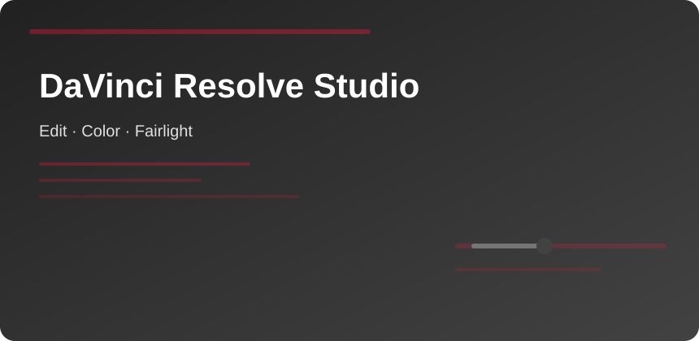

  

  

## DaVinci Resolve Studio

One timeline carries **cut**, **grade**, **Fusion comps**, and **Fairlight mixes**—Studio unlocks noise reduction, advanced scopes, and multiple GPU decode paths.

### Page map

| Page | Job |
|------|-----|
| Edit | Assembly, multicam, speed ramps |
| Cut | Fast first pass |
| Fusion | Compositing inside clips |
| Color | Primary/secondary grades |
| Fairlight | ADR, stems, loudness |

### Hardware reality

- NVMe project disk
- GPU with ≥8 GB VRAM for 4K RAW nodes
- Proxy workflow on laptops

### Export habit

Render queue overnight; use preset naming `{project}_{date}_{master}`.

davinci resolve studio video editing color grading blackmagic
